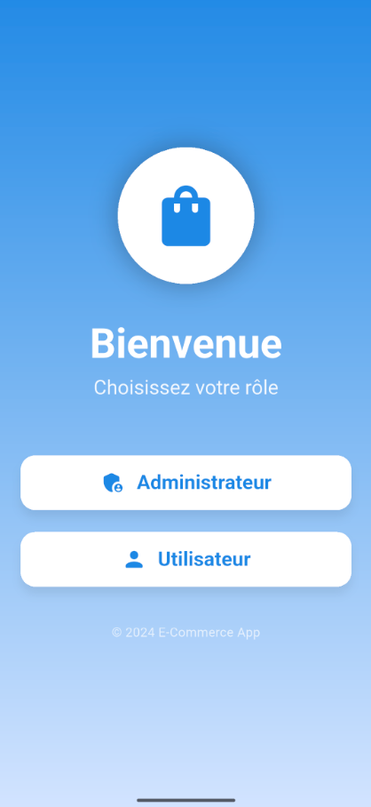
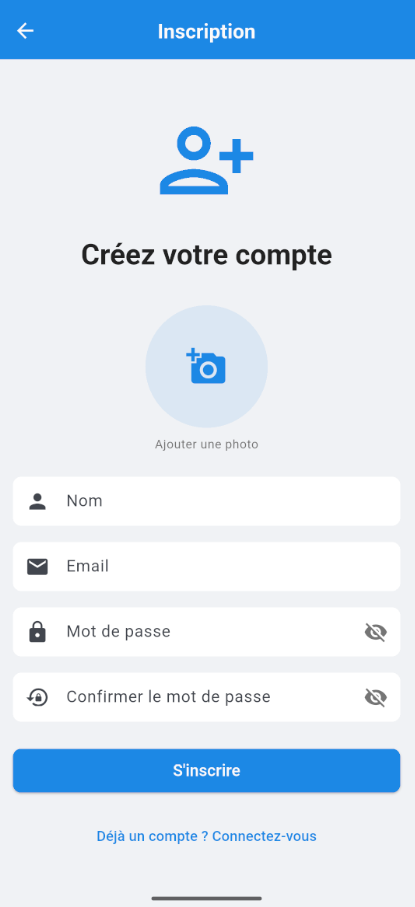
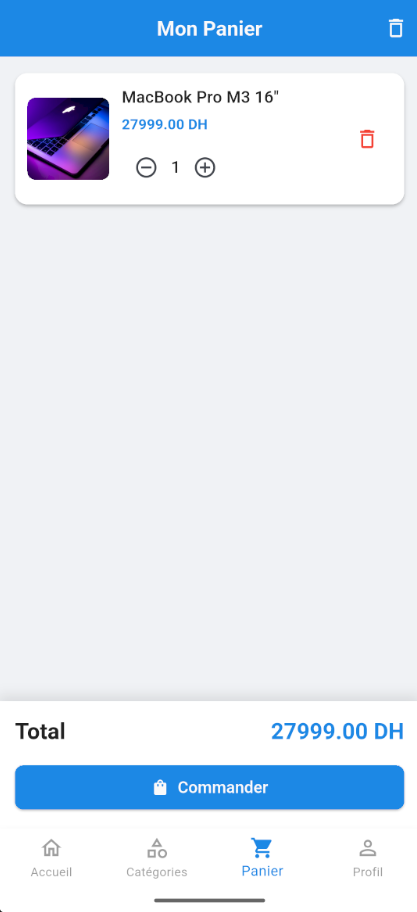
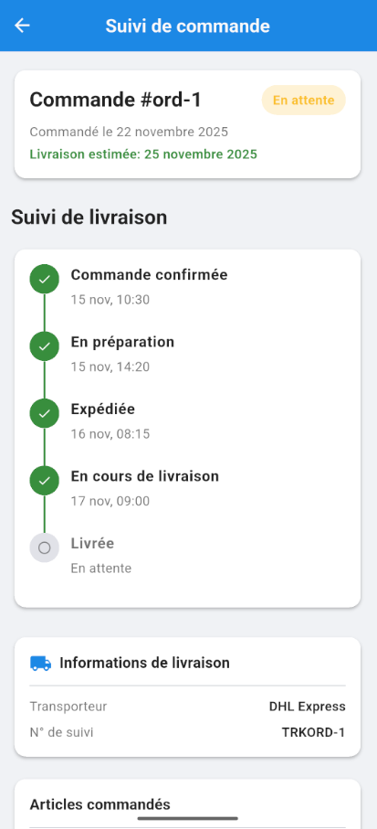
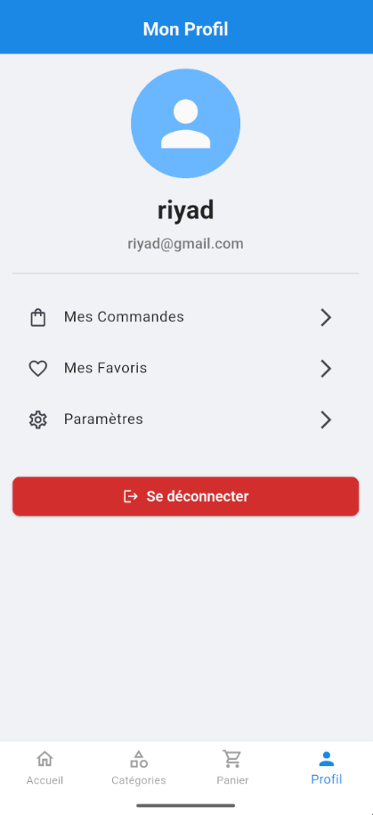
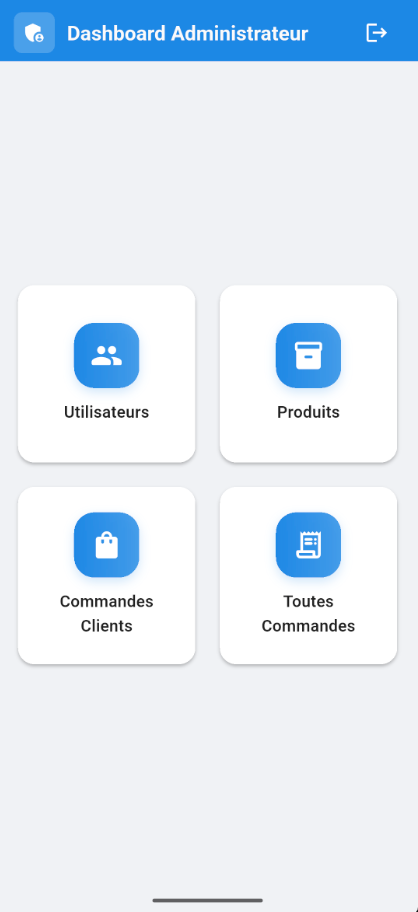
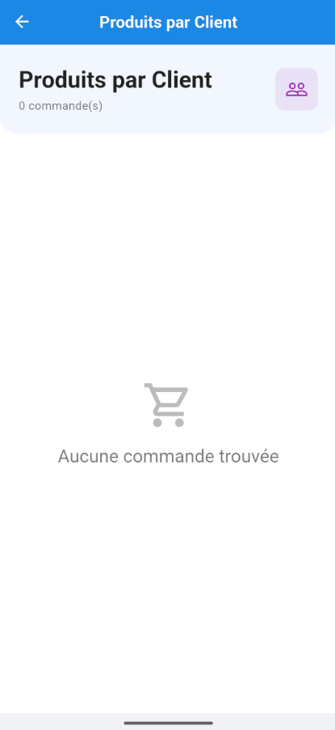
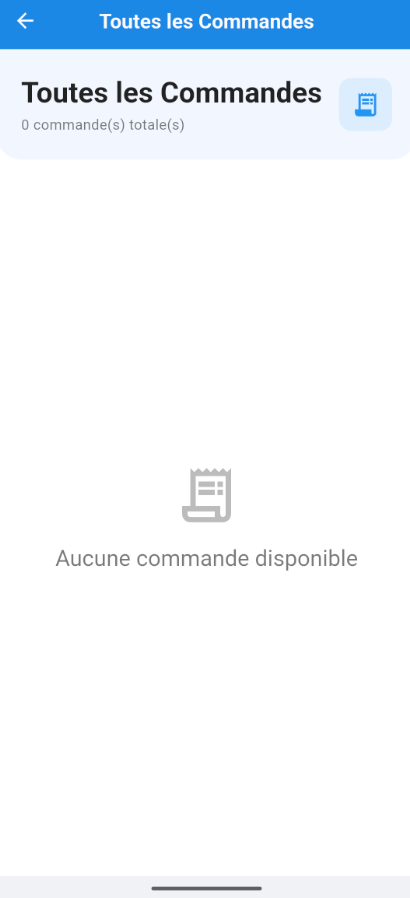
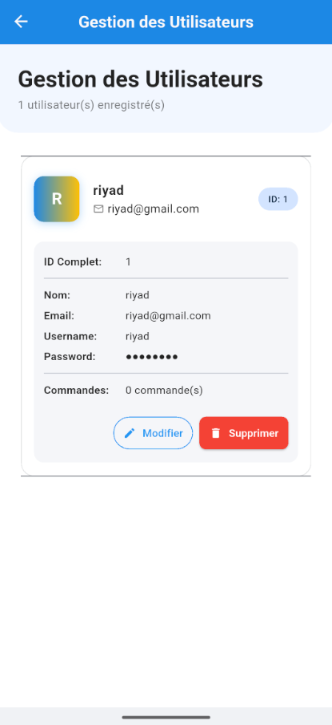

# 🛍️ Electronics Store - Application E-commerce Flutter

<div align="center">


Une application e-commerce spécialisée en électronique développée avec Flutter, offrant une expérience utilisateur fluide et professionnelle pour l'achat de produits électroniques.

[Fonctionnalités](#-fonctionnalités) • [Installation](#-installation) • [Architecture](#-architecture) • [Technologies](#-technologies) • [Screenshots](#-screenshots)

</div>

---

## 📋 Table des matières

- [À propos](#-à-propos)
- [Fonctionnalités](#-fonctionnalités)
- [Technologies utilisées](#-technologies-utilisées)
- [Architecture](#-architecture)
- [Installation](#-installation)
- [Configuration](#-configuration)
- [Utilisation](#-utilisation)
- [Structure du projet](#-structure-du-projet)
- [Base de données](#-base-de-données)
- [API Mock](#-api-mock)
- [Tests](#-tests)
- [Améliorations UI/UX](#-améliorations-uiux)
- [Captures d'écran](#-captures-décran)
- [Roadmap](#-roadmap)
- [Contribution](#-contribution)
- [Licence](#-licence)
- [Contact](#-contact)

---

## 🎯 À propos

**Electronics Store** est une application mobile e-commerce spécialisée dans la vente de produits électroniques, développée avec Flutter dans le cadre d'un projet universitaire. L'application offre une expérience d'achat moderne pour smartphones, ordinateurs, tablettes, audio, photo/vidéo, gaming et accessoires électroniques, avec une interface utilisateur élégante, des animations fluides et une architecture robuste suivant les principes de Clean Architecture.

### Objectifs du projet

- ✅ Créer une application e-commerce fonctionnelle et complète
- ✅ Implémenter une architecture propre et maintenable (Clean Architecture)
- ✅ Offrir une expérience utilisateur moderne et fluide
- ✅ Gérer l'authentification et les sessions utilisateurs
- ✅ Intégrer une base de données locale (SQLite)
- ✅ Développer un panel d'administration complet
- ✅ Assurer la persistance des données hors ligne

---

## ✨ Fonctionnalités

### 🔐 Authentification
- Inscription avec validation des champs
- Connexion avec gestion de session
- Déconnexion sécurisée
- Persistance de la session
- Gestion des profils utilisateurs

### 🛒 Catalogue produits électroniques

- **7 catégories spécialisées** :
  - 📱 Smartphones (iPhone, Samsung, Google, Xiaomi)
  - 💻 Ordinateurs (MacBook, Dell, Lenovo, ASUS)
  - 📲 Tablettes (iPad, Galaxy Tab, Surface)
  - 🎧 Audio (Casques, Écouteurs, Enceintes)
  - 📷 Photo & Vidéo (Appareils photo, Drones, Caméras)
  - 🎮 Gaming (Consoles, Accessoires gaming)
  - 🔌 Accessoires (Électronique divers)
- Recherche avancée de produits électroniques
- Filtrage multi-critères (prix, popularité, note, marque)
- Détails complets avec spécifications techniques
- Système de notation et avis clients
- Images haute qualité optimisées avec cache

### 🛍️ Panier d'achat
- Ajout/suppression de produits
- Modification des quantités
- Calcul automatique du total
- Persistance du panier
- Animation fluide des actions

### ❤️ Favoris
- Gestion des produits favoris
- Synchronisation avec le compte
- Accès rapide aux produits préférés

### 📦 Commandes
- Historique des commandes
- Détails de chaque commande
- Suivi de statut (En cours, Livrée, Annulée)
- Annulation de commande

### 👤 Profil utilisateur
- Modification des informations
- Changement de mot de passe
- Gestion de photo de profil
- Historique d'activité

### ⚙️ Administration
- Dashboard administrateur complet
- Gestion des utilisateurs (CRUD)
- Gestion des produits (CRUD)
- Gestion des catégories (CRUD)
- Gestion des commandes
- Visualisation de la base de données
- Statistiques et métriques

### 🎨 Expérience utilisateur
- **Skeleton Loading** : Chargement élégant avec effet shimmer
- **Pull-to-Refresh** : Actualisation intuitive
- **Animations fluides** : Transitions et animations staggered
- **Mode sombre** : Thème clair/sombre adaptatif
- **Design responsive** : Adapté à toutes les tailles d'écran
- **Navigation intuitive** : Bottom navigation + routes nommées

---

## 🛠️ Technologies utilisées

### Framework & Langage
- **Flutter** 3.0+ - Framework UI multiplateforme
- **Dart** 3.0+ - Langage de programmation

### État & Navigation
- **Provider** ^6.1.2 - Gestion d'état
- **GoRouter** ^14.0.0 - Navigation déclarative et routing

### Base de données
- **SQLite** (sqflite ^2.3.0) - Base de données locale
- **Path Provider** ^2.1.3 - Gestion des chemins de fichiers

### Réseau & API
- **Dio** ^5.4.3 - Client HTTP
- **Pretty Dio Logger** ^1.3.1 - Logs formatés

### UI/UX
- **Shimmer** ^3.0.0 - Skeleton loading animations
- **Flutter Staggered Animations** ^1.1.1 - Animations avancées
- **Cached Network Image** ^3.3.1 - Cache d'images optimisé

### Utilitaires
- **Get It** ^7.6.7 - Injection de dépendances
- **Dartz** ^0.10.1 - Programmation fonctionnelle
- **Equatable** ^2.0.5 - Comparaison d'objets
- **Image Picker** ^1.0.7 - Sélection d'images

---

## 🏗️ Architecture

Le projet suit les principes de **Clean Architecture** avec une séparation claire des responsabilités :

```
lib/
├── core/                      # Code partagé
│   ├── constants/            # Constantes globales
│   ├── database/             # Configuration SQLite
│   ├── error/                # Gestion des erreurs
│   ├── network/              # Configuration réseau
│   ├── usecases/             # Use cases abstraits
│   └── utils/                # Utilitaires
│
├── data/                      # Couche de données
│   ├── datasources/          # Sources de données
│   │   ├── local/           # Base de données locale
│   │   └── remote/          # API externe
│   ├── models/               # Modèles de données
│   └── repositories/         # Implémentations repositories
│
├── domain/                    # Couche métier
│   ├── entities/             # Entités métier
│   ├── repositories/         # Interfaces repositories
│   └── usecases/             # Cas d'utilisation métier
│
└── presentation/             # Couche présentation
    ├── pages/                # Écrans de l'application
    ├── providers/            # Providers (état)
    ├── themes/               # Thèmes et styles
    └── widgets/              # Composants réutilisables
```

### Principes appliqués

✅ **Separation of Concerns** - Séparation claire des responsabilités  
✅ **Dependency Inversion** - Les dépendances pointent vers les abstractions  
✅ **Single Responsibility** - Chaque classe a une seule responsabilité  
✅ **Clean Code** - Code lisible et maintenable  
✅ **SOLID Principles** - Principes de conception orientée objet

---

## 📥 Installation

### Prérequis

- Flutter SDK 3.0 ou supérieur
- Dart SDK 3.0 ou supérieur
- Android Studio / VS Code
- Git

### Étapes d'installation

1. **Cloner le repository**
```bash
git clone https://github.com/votre-username/online-shop.git
cd online-shop
```

2. **Installer les dépendances**
```bash
flutter pub get
```

3. **Générer l'icône de l'application** (optionnel)
```bash
flutter pub run flutter_launcher_icons
```

4. **Lancer l'application**
```bash
# Mode debug
flutter run

# Mode release
flutter run --release
```

### Plateformes supportées

✅ Android  
✅ iOS  
✅ Web (en développement)  
✅ Windows (en développement)  
✅ macOS (en développement)  
✅ Linux (en développement)

---

## ⚙️ Configuration

### Base de données

La base de données SQLite est automatiquement initialisée au premier lancement avec :
- **Version actuelle** : 6
- **Nom du fichier** : `ecommerce.db`
- **Tables** : users, products, categories, cart_items, orders, favorites, auth_tokens, addresses

### Variables d'environnement

Créer un fichier `.env` à la racine du projet (optionnel pour API externe) :

```env
API_BASE_URL=https://votre-api.com
API_KEY=votre_cle_api
```

### Configuration Mock API (pour développement)

Le projet inclut une API mock Node.js dans le dossier `api_mock/` :

```bash
cd api_mock
npm install
npm start
```

L'API mock sera disponible sur `http://localhost:3000`

---

## 🚀 Utilisation

### Connexion test

Pour tester l'application, utilisez les identifiants suivants :

**Utilisateur standard :**
- Email : `user@test.com`
- Mot de passe : `password123`

**Administrateur :**
- Email : `admin@shop.com`
- Mot de passe : `admin123`

### Navigation principale

L'application dispose de 4 sections principales accessibles via la navigation en bas :

1. **🏠 Accueil** - Catégories et produits mis en avant
2. **🔍 Explorer** - Catalogue complet avec filtres
3. **🛒 Panier** - Gestion du panier d'achat
4. **👤 Profil** - Compte utilisateur et paramètres

### Fonctionnalités administrateur

Accessible via le menu du profil > "Admin Dashboard" (si connecté en tant qu'admin) :

- Gestion complète des produits
- Gestion des utilisateurs
- Gestion des catégories
- Suivi des commandes
- Visualisation de la base de données

---

## 📁 Structure du projet

```
online-shop/
│
├── android/                   # Configuration Android
├── ios/                       # Configuration iOS
├── web/                       # Configuration Web
├── windows/                   # Configuration Windows
├── macos/                     # Configuration macOS
├── linux/                     # Configuration Linux
│
├── assets/                    # Ressources statiques
│   └── images/               # Images de l'application
│
├── lib/                       # Code source Dart
│   ├── core/                 # Fonctionnalités partagées
│   ├── data/                 # Couche de données
│   ├── domain/               # Couche métier
│   ├── presentation/         # Couche UI
│   ├── injection_container.dart  # DI setup
│   └── main.dart            # Point d'entrée
│
├── test/                      # Tests unitaires et widgets
├── api_mock/                  # Serveur API mock (Node.js)
├── scripts/                   # Scripts utilitaires
│
├── pubspec.yaml              # Dépendances Flutter
├── analysis_options.yaml     # Règles d'analyse Dart
├── README.md                 # Ce fichier
├── RAPPORT.md                # Rapport de projet
└── AMELIORATIONS_UI_UX.md   # Documentation UI/UX
```

---

## 🗄️ Base de données

### Schéma SQLite

#### Table `users`
```sql
CREATE TABLE users (
  id TEXT PRIMARY KEY,
  name TEXT NOT NULL,
  email TEXT NOT NULL UNIQUE,
  username TEXT NOT NULL UNIQUE,
  password TEXT NOT NULL,
  profile_image TEXT,
  created_at TEXT NOT NULL,
  updated_at TEXT NOT NULL
)
```

#### Table `products`
```sql
CREATE TABLE products (
  id TEXT PRIMARY KEY,
  name TEXT NOT NULL,
  description TEXT,
  price REAL NOT NULL,
  discount_price REAL,
  image_url TEXT,
  category_id TEXT,
  brand TEXT,
  rating REAL,
  review_count INTEGER,
  created_at TEXT NOT NULL
)
```

#### Table `orders`
```sql
CREATE TABLE orders (
  id TEXT PRIMARY KEY,
  user_id TEXT NOT NULL,
  total_amount REAL NOT NULL,
  status TEXT NOT NULL,
  created_at TEXT NOT NULL,
  updated_at TEXT NOT NULL
)
```

#### Autres tables
- `categories` - Catégories de produits
- `cart_items` - Articles du panier
- `favorites` - Produits favoris
- `auth_tokens` - Tokens d'authentification
- `addresses` - Adresses de livraison

### Migrations

Le système de migration automatique gère les mises à jour de schéma :
- Version 1 → 2 : Ajout tables users et products
- Version 2 → 3 : Ajout champ password
- Version 3 → 4 : Amélioration index
- Version 4 → 5 : Table addresses
- Version 5 → 6 : Optimisations

---

## 🌐 API Mock

Un serveur Node.js est fourni pour le développement local :

### Endpoints disponibles

```
GET    /api/products          # Liste des produits
GET    /api/products/:id      # Détails d'un produit
POST   /api/products          # Créer un produit
PUT    /api/products/:id      # Modifier un produit
DELETE /api/products/:id      # Supprimer un produit

POST   /api/auth/login        # Connexion
POST   /api/auth/register     # Inscription
POST   /api/auth/logout       # Déconnexion

GET    /api/categories        # Liste des catégories
GET    /api/orders            # Liste des commandes
POST   /api/orders            # Créer une commande
```

---

## 🧪 Tests

### Lancer les tests

```bash
# Tests unitaires
flutter test

# Tests avec couverture
flutter test --coverage

# Tests d'intégration
flutter test integration_test/
```

### Types de tests

- ✅ Tests unitaires (domain, data)
- ✅ Tests de widgets (UI)
- 🔄 Tests d'intégration (en cours)
- 🔄 Tests E2E (à venir)

---

## 🎨 Améliorations UI/UX

### Implémentées récemment

✅ **Skeleton Loading**
- Chargement élégant avec effet shimmer
- 5 types de skeletons réutilisables
- Améliore la perception de performance

✅ **Pull to Refresh**
- Actualisation intuitive sur toutes les listes
- Feedback visuel clair

✅ **Animations fluides**
- Animations staggered sur les listes
- Transitions de page fluides
- Micro-interactions sur les boutons

✅ **Mode sombre**
- Thème adaptatif automatique
- Basculement manuel disponible

### En développement

🔄 **Infinite Scroll** - Chargement automatique en défilement  
🔄 **Animations de page** - Transitions personnalisées  
🔄 **Haptic Feedback** - Retour tactile sur interactions

Voir [AMELIORATIONS_UI_UX.md](AMELIORATIONS_UI_UX.md) pour plus de détails.

---

## 📱 Captures d'écran

### Page de Lancement

| Écran d'Accueil |
|-----------------|
|  |
*Premier écran affiché au lancement de l'application*

### Authentification

#### Utilisateur

| Inscription | Connexion Utilisateur |
|------------|----------------------|
|  |  |

#### Administrateur

| Connexion Admin |
|-----------------|
|  |

### Interface Utilisateur

| Catalogue Produits | Détails Produit | Panier |
|-------------------|----------------|--------|
|  |  |  |

| Commandes | Suivi Commande | Profil |
|-----------|----------------|--------|
|  |  |  |

### Panel d'Administration

| Dashboard Admin | Gestion Produits |
|----------------|------------------|
|  |  |

| Produits par Client | Toutes les Commandes | Gestion Utilisateurs |
|---------------------|---------------------|---------------------|
|  |  |  |

---

## 🗺️ Roadmap

### Version 1.1 (En cours)
- [ ] Infinite scroll sur le catalogue
- [ ] Notifications push
- [ ] Partage de produits
- [ ] Mode hors ligne complet

### Version 1.2 (Prévue)
- [ ] Paiement intégré
- [ ] Chat support client
- [ ] Programme de fidélité
- [ ] Recommandations personnalisées

### Version 2.0 (Future)
- [ ] Multi-langue (i18n)
- [ ] Multi-devise
- [ ] Géolocalisation des points de vente
- [ ] Réalité augmentée (AR) pour les produits

---

## 🤝 Contribution

Les contributions sont les bienvenues ! Voici comment contribuer :

1. **Fork** le projet
2. **Créer** une branche feature (`git checkout -b feature/AmazingFeature`)
3. **Commit** les changements (`git commit -m 'Add some AmazingFeature'`)
4. **Push** vers la branche (`git push origin feature/AmazingFeature`)
5. **Ouvrir** une Pull Request

### Guidelines

- Suivre les conventions de code Dart
- Ajouter des tests pour les nouvelles fonctionnalités
- Documenter le code avec des commentaires clairs
- Respecter l'architecture Clean Architecture

---

## 📊 Statistiques du projet


---

<div align="center">

### ⭐ Si ce projet vous a été utile, n'hésitez pas à lui donner une étoile !


[⬆ Retour en haut](#️-electronics-store---application-e-commerce-flutter)

</div>